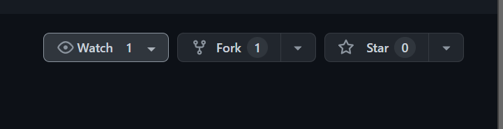
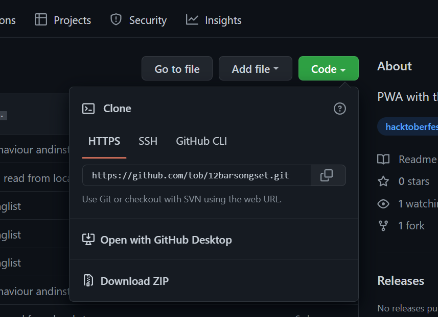
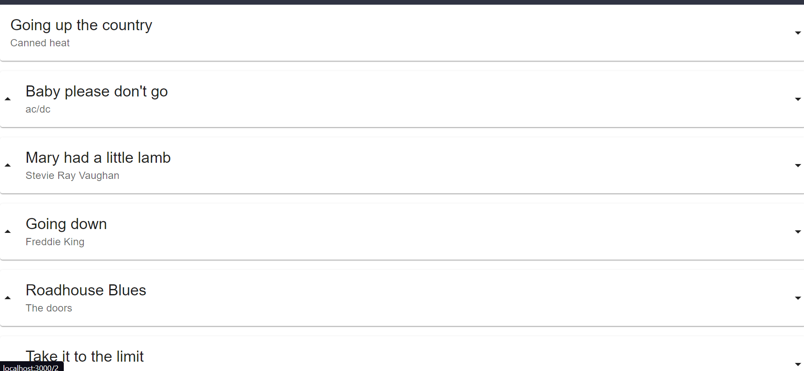

Prerequisites
Before installation, please make sure you have already installed the following tools:

* git
* Nodejs

🛠️ Installation Steps
1) Fork the project 

2) Clone the forked project

3) Navigate to the cloned project directory
4) Install the dependencies with yarn install
-> just type yarn ( To install the dependencies )
5) To start the server type yarn start 
->( this command will start your server )

I made this app to be able to have the songset displayed on a tablet when playing live with my band. 
This PWA is installed on the tablet of the singer that uses it to reorder his songs and read the lyrics.

The app makes the most of all the spaces available in the viewport by displaying the text in columns.
It is also possible to increase and decrease the size of the lyrics to have them fitting the screen.

screen-shot:

detail screen-shot is here  (down side )  👇

